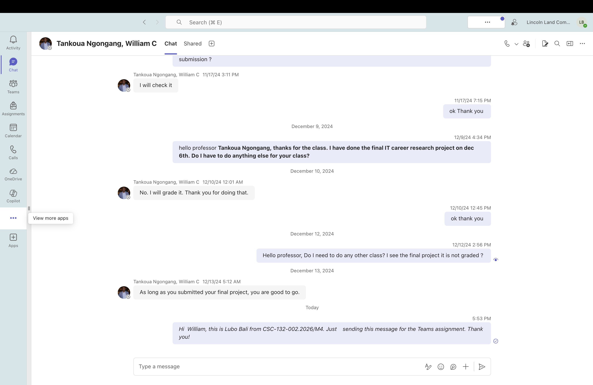

# Bitcoin Real-Time Streaming Pipeline — Delta Live Tables

Real-time Bitcoin trade pipeline built with Databricks Delta Live Tables. Ingests BTC-USD trades from Polygon.io WebSocket API, processes through Bronze/Silver/Gold medallion architecture with quarantine pattern for data quality. Includes Plotly analysis charts.

## Architecture

```
Polygon WebSocket API (Bitcoin Trades)
        |
        v
  +--------------+
  |   Bronze      |  Raw trade events, minimal parsing
  |   Table       |
  +------+-------+
         |
         v
  +--------------+
  |   Enriched    |  Intermediate view (pre-quality-split)
  |   View        |
  +--+--------+--+
     |        |
     v        v
+--------+ +--------------+
| Silver | |  Quarantine  |  Bad rows captured for debugging
| Table  | |  Table       |
+---+----+ +--------------+
    |
    v
+--------+
|  Gold  |  1-minute OHLCV candlestick aggregations
|  Table |
+--------+
```

## Data Source

- **API**: Polygon.io Crypto WebSocket
- **Endpoint**: `wss://socket.polygon.io/crypto`
- **Subscription**: `XT.X:BTC-USD` (crypto trades for BTC/USD)
- **API Key**: Stored in Databricks secrets (not in code)

### Polygon Trade Message Format

```json
{
  "ev": "XT",
  "pair": "X:BTC-USD",
  "p": 67234.50,
  "s": 0.00123,
  "t": 1710345600000,
  "c": [2],
  "i": "trade123",
  "x": 1,
  "r": 1710345600123
}
```

## Pipeline Layers

| Layer | Table | Description |
|-------|-------|-------------|
| Bronze | `btc_trades_bronze` | Raw trade events with renamed columns and timestamps |
| View | `btc_trades_enriched_v` | Enriched trades with `trade_value_usd`, single source for quality split |
| Silver | `btc_trades_silver` | Clean trades passing all quality checks (valid price, size, time, event type) |
| Quarantine | `btc_trades_quarantine` | Failed trades with `quarantine_reason` column for debugging |
| Gold | `btc_candles_1m` | 1-minute OHLCV candlestick aggregations with volume |

## Quarantine Pattern

The pipeline uses the quarantine pattern for data quality — bad rows are captured instead of silently dropped.

Both Silver and Quarantine read from the same enriched view. Silver keeps clean rows via `@dlt.expect_or_drop`. Quarantine filters for bad rows and tags each with a reason. Together: Silver + Quarantine = all rows. Nothing is lost.

## Data Quality Expectations (Silver)

| Rule | Condition |
|------|-----------|
| `valid_price` | `price IS NOT NULL AND price > 0` |
| `valid_size` | `size IS NOT NULL AND size > 0` |
| `valid_trade_time` | `trade_time IS NOT NULL` |
| `valid_event_type` | `event_type = 'XT'` |

## Analysis Charts

`btc_analysis_charts.py` reads from Silver and Quarantine tables and generates 6 Plotly visualizations:

| Chart | What it shows |
|-------|--------------|
| BTC Price Over Time | Line chart of trade prices |
| Trade Volume Per Trade | Bar chart of BTC volume per trade |
| Trade Value Distribution | Histogram of USD trade values |
| Price vs Volume Scatter | Bubble chart (size = USD value, color = exchange) |
| Data Quality Pie | Clean vs quarantined trade ratio |
| Quarantine Reasons | Breakdown of why trades failed quality checks |

## Pipeline Results



- **Bronze**: 18 trades ingested
- **Silver**: 15 clean trades (83.3%)
- **Quarantine**: 3 bad trades captured (16.7%)
- **Gold**: 1-minute OHLCV candlesticks

## Setup

1. Upload `bitcoin_dlt_pipeline.py` as a Databricks notebook
2. Create a DLT pipeline pointing to the notebook
3. Set catalog and schema in pipeline settings
4. Add configuration parameters:
   - `secret_scope` = your Databricks secret scope
   - `secret_key` = your Polygon API key name
   - `polygon_raw_path` = path to your raw trade JSON files
5. Run the pipeline

## Tech Stack

- Databricks Delta Live Tables
- Spark Structured Streaming
- Polygon.io WebSocket API
- Plotly (analysis charts)
- Python / PySpark
